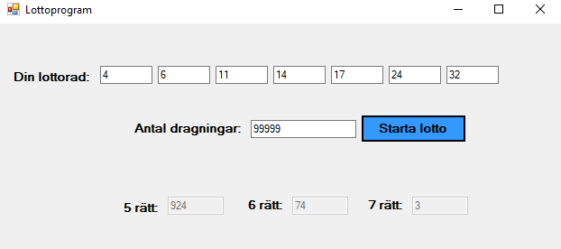

A small lottery game made in c#.net for a university course.

The program simulates lottery draws, user inputs their 7 lottery numbers and x amount of "draws" of simulation.
Receives back outcome of the x simulations and how many times their number would have won out of x times.

  

In the example above my lottery numbers was 4 - 6 - 11 - 14 - 17 - 24 - 32 and I simulated 99999 draws.
Out of the 99999 draws: I had 5 numbers right 924 times, 6 numbers right 74 times and all 7 numbers right only 3 times.

